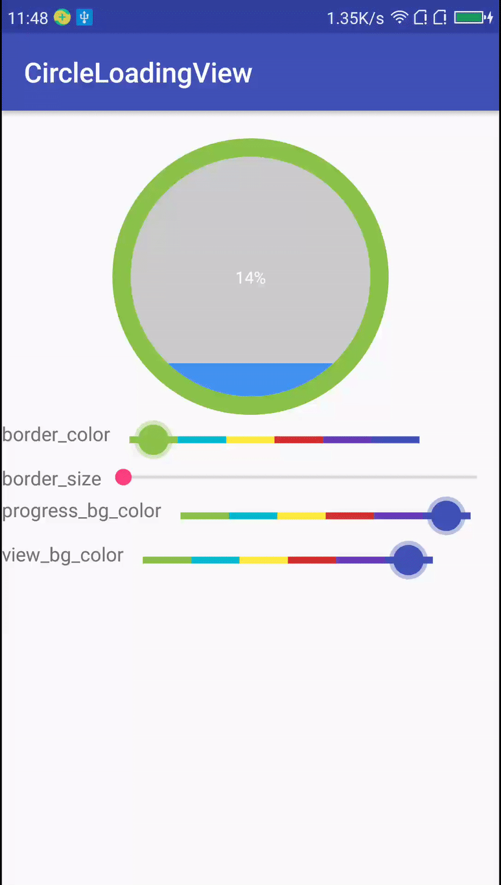

# CircleLoadingView


###(1)设置边框颜色
###(2)设置边框宽度
###(3)设置进度颜色
###(4)设置背景色
###(5)设置进度文本大小
###(6)设置进度文本颜色

## Usage
```xml
<com.ll.circleloadingview.CircleLoadingView
        android:id="@+id/circleLoadingView"
        android:layout_width="200dp"
        android:layout_height="200dp"
        android:layout_gravity="center_horizontal"
        android:layout_marginTop="20dp"
        app:borderColor="#00aaaa"
        app:borderWidth="2dp"
        app:circleViewBgColor="#CCCCCC"
        app:progressBgColor="@color/colorAccent"
        app:progressTextColor="#000000"
        app:progressTextSize="14sp" />
```
